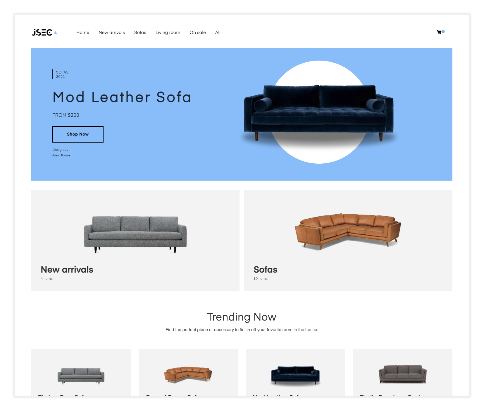
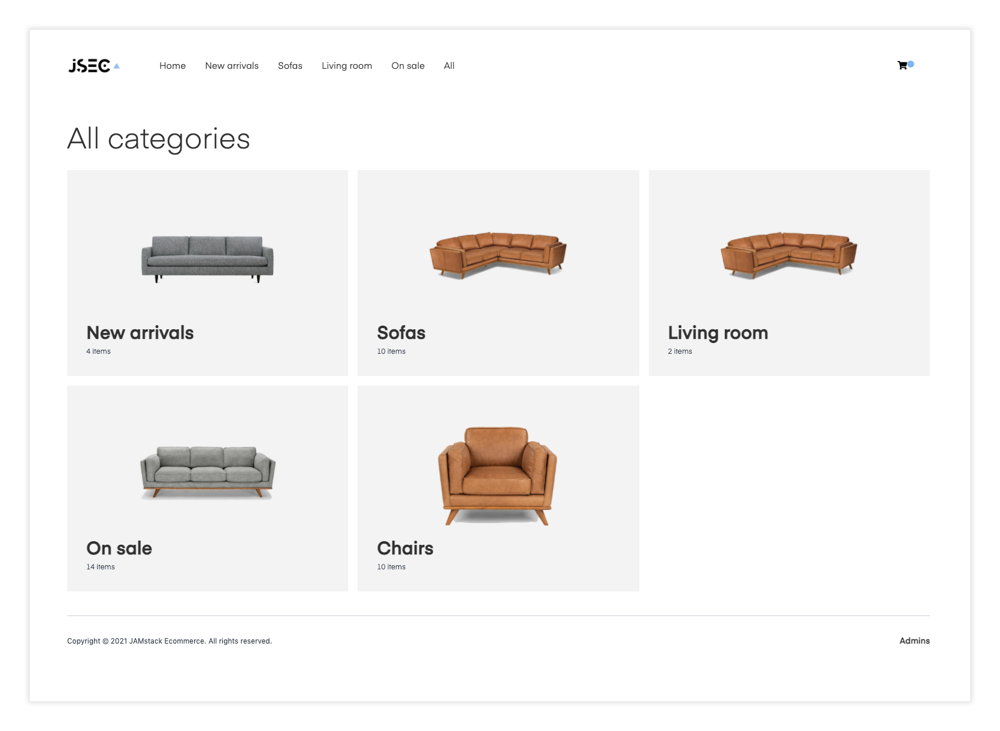
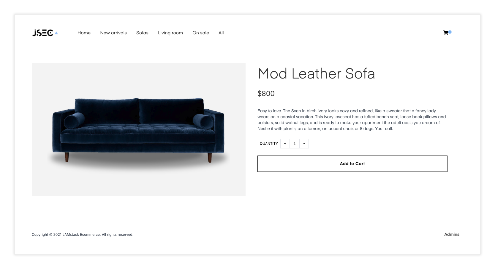
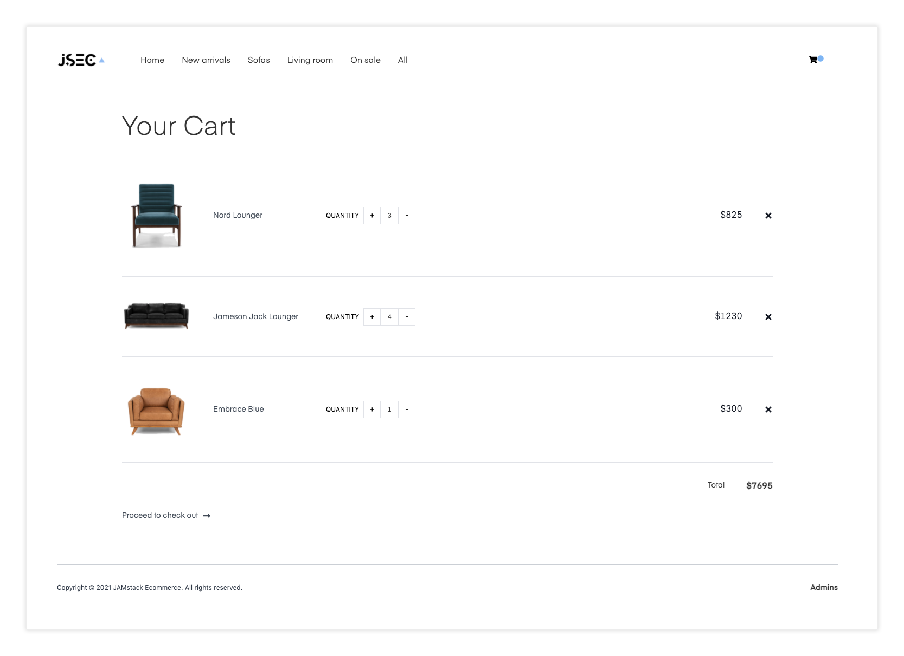
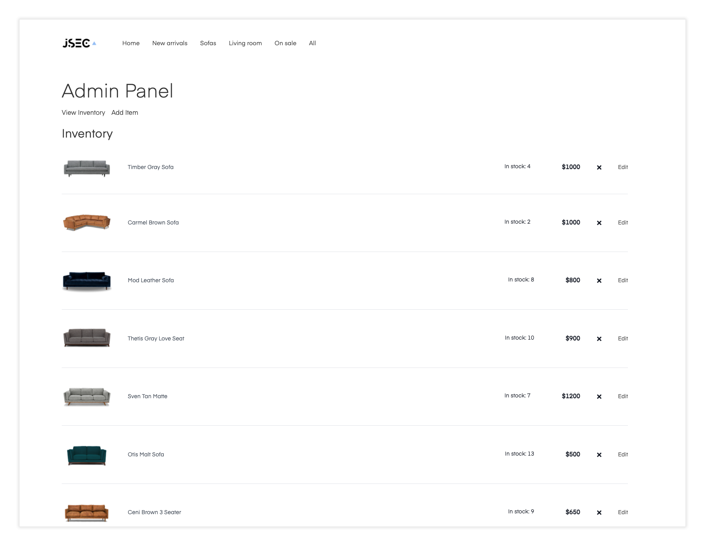

## Онлайн дэлгүүр Next

Онлайн дэлгүүр Next provides a way to quickly get up and running with a fully configurable ECommerce site using Next.js.

Out of the box, the site uses completely static data coming from a provider at `providers/inventoryProvider.js`. You can update this provider to fetch data from any real API by changing the call in the `getInventory` function.



### Live preview

Click [here](https://www.jamstackecommerce.dev/) to see a live preview.

<details>
  <summary>Other Онлайн дэлгүүр pages</summary>

### Category view



### Item view



### Cart view



### Admin panel



</details>

### Getting started

1. Clone the project

```sh
$ git clone https://github.com/jamstack-cms/jamstack-ecommerce.git
```

2. Install the dependencies:

```sh
$ yarn

# or

$ npm install
```

3. Run the project

```sh
$ npm run dev

# or to build

$ npm run build
```

## Deploy to Vercel

Use the [Vercel CLI](https://vercel.com/download)

```sh
vercel
```

## Deploy to AWS

```sh
npx serverless
```

## About the project

### Tailwind

This project is styled using Tailwind. To learn more how this works, check out the Tailwind documentation [here](https://tailwindcss.com/docs).

### Components

The main files, components, and images you may want to change / modify are:

**Logo** - public/logo.png  
**Button, ListItem, etc..** - components  
**Form components** - components/formComponents  
**Context (state)** - context/mainContext.js  
**Pages (admin, cart, checkout, index)** - pages  
**Templates (category view, single item view, inventory views)** - templates

### How it works

As it is set up, inventory is fetched from a local hard coded array of inventory items. This can easily be configured to instead be fetched from a remote source like Shopify or another CMS or data source by changing the inventory provider.

#### Configuring inventory provider

Update **utils/inventoryProvider.js** with your own inventory provider.

#### Download images at build time

If you change the provider to fetch images from a remote source, you may choose to also download the images locally at build time to improve performance. Here is an example of some code that should work for this use case:

```javascript
import fs from "fs"
import axios from "axios"
import path from "path"

function getImageKey(url) {
  const split = url.split("/")
  const key = split[split.length - 1]
  const keyItems = key.split("?")
  const imageKey = keyItems[0]
  return imageKey
}

function getPathName(url, pathName = "downloads") {
  let reqPath = path.join(__dirname, "..")
  let key = getImageKey(url)
  key = key.replace(/%/g, "")
  const rawPath = `${reqPath}/public/${pathName}/${key}`
  return rawPath
}

async function downloadImage(url) {
  return new Promise(async (resolve, reject) => {
    const path = getPathName(url)
    const writer = fs.createWriteStream(path)
    const response = await axios({
      url,
      method: "GET",
      responseType: "stream",
    })
    response.data.pipe(writer)
    writer.on("finish", resolve)
    writer.on("error", reject)
  })
}

export default downloadImage
```

You can use this function to map over the inventory data after fetching and replace the image paths with a reference to the location of the downloaded images, probably would look something like this:

```javascript
await Promise.all(
  inventory.map(async (item, index) => {
    try {
      const relativeUrl = `../downloads/${item.image}`
      if (!fs.existsSync(`${__dirname}/public/downloads/${item.image}`)) {
        await downloadImage(image)
      }
      inventory[index].image = relativeUrl
    } catch (err) {
      console.log("error downloading image: ", err)
    }
  })
)
```

### Updating with Auth / Admin panel

1. Update **pages/admin.js** with sign up, sign, in, sign out, and confirm sign in methods.

2. Update **components/ViewInventory.js** with methods to interact with the actual inventory API.

3. Update **components/formComponents/AddInventory.js** with methods to add item to actual inventory API.

### Roadmap

- Full product and category search
- Auto dropdown navigation for large number of categories
- Ability to add more / more configurable metadata to item details
- Themeing + dark mode
- Optional user account / profiles out of the box
- Make Admin Panel responsive
- Have an idea or a request? Submit [an issue](https://github.com/jamstack-cms/jamstack-ecommerce/issues) or [a pull request](https://github.com/jamstack-cms/jamstack-ecommerce/pulls)!

### Other considerations

#### Server-side processing of payments

To see an example of how to process payments server-side with stripe, check out the [Lambda function in the snippets folder](https://github.com/jamstack-cms/jamstack-ecommerce/blob/next/snippets/lambda.js).

Also, consider verifying totals by passing in an array of IDs into the function, calculating the total on the server, then comparing the totals to check and make sure they match.
